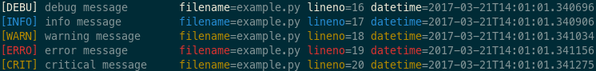

# LogrusFormatter #
[](https://travis-ci.org/velp/logrus-formatter)
[](https://coveralls.io/r/velp/logrus-formatter)

Logrus is a library for formatting the output of a standard logging system in a python. Modifies the log records, making them simulating [Logrus golang library](https://github.com/sirupsen/logrus>).

## Installation
LogrusFormatter can be installed from PyPi:
```bash
pip install logrusformatter
```

## Usage
```python
import sys
import logging
from logrusformatter import LogrusFormatter

# Init formatter
fmt_string = "%(levelname)s %(message)-20s %(filename)s %(lineno)s %(datetime)s"
fmtr = LogrusFormatter(colorize=True, fmt=fmt_string)
# Create logger
logger = logging.getLogger('example')
logger.setLevel(logging.DEBUG)
# Add handler
hdlr = logging.StreamHandler(sys.stdout)
hdlr.setFormatter(fmtr)
logger.addHandler(hdlr)
# Example logging
logger.debug("debug message")
logger.info("info message")
logger.warning("warning message")
logger.error("error message")
logger.critical("critical message")
```
In result nicely color-coded output:


## Tests
You can run the tests by invoking
```bash
python -m unittest discover ./tests
```
in the repository root.
